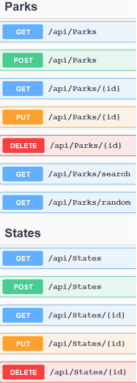
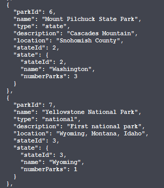
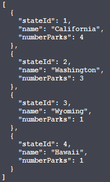
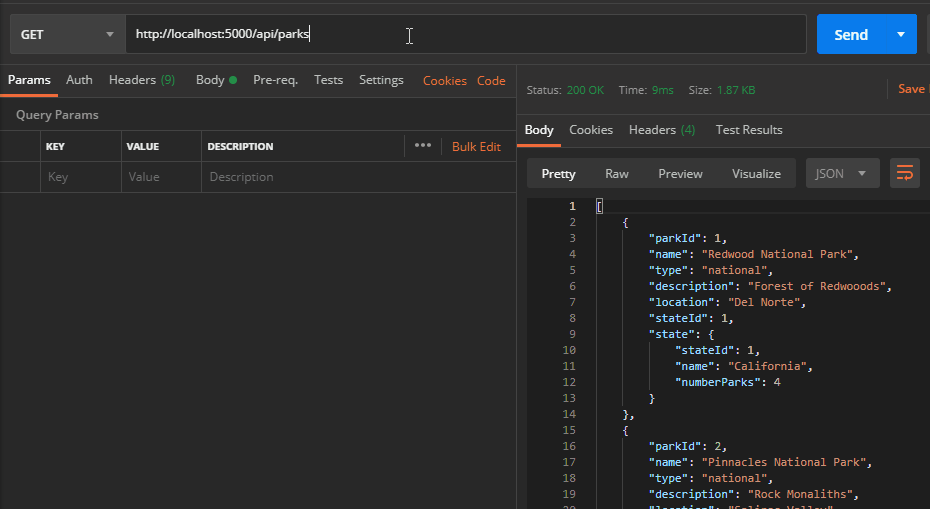

# _[Park API](https://github.com/TSiu88/parkApi)_

#### _Week 13 Friday Independent Assignment for Epicodus, 04.03.2020_

#### By _**Tiffany Siu**_

---
## Table of Contents
1. [Description](#description)
2. [Setup/Installation Requirements](#setup/installation-requirements)
    - [Requirements to Run](#requirements-to-run)
    - [Instructions](#instructions)
    - [Other Technologies Used](#other-technologies-used)
3. [Notable Features](#notable-features)
4. [Specifications](#specifications)
    - [Assigment Objectives](#assignment-objectives)
    - [User Stories](#user-stories)
5. [Screenshots](#screenshots)
6. [Known Bugs](#known-bugs)
7. [Support and Contact Details](#support-and-contact-details)
8. [License](#license)
---
## Description

This application is the Week 13 Friday independent assignment for Epicodus' full time Intro to Programming and C#/React course.  This is an application made to show building a custom API with full functionality and include a more advanced function.

For this API, a user can add information and locations of parks found in the US.  The parks can be stored with a name, type (national or state), description, location/city, and state.  The database can be searched for these properties with the correct route structure.  States can also be stored in another table in the database and also holds the number of parks that are within that state.  The number of parks updates when parks are added, deleted, or modified.

## Setup/Installation Requirements

_This program requires .NET Core SDK to run. [Here is a free tutorial](https://www.learnhowtoprogram.com/c-and-net/getting-started-with-c/installing-c-and-net) for installing .NET on Mac or Windows 10 from the [official website](https://dotnet.microsoft.com/download/dotnet-core/)._ 

_This program also makes use of SQL databases. We recommend using MySQL Workbench to build your databases. [Here is a free tutorial](https://www.learnhowtoprogram.com/c-and-net/getting-started-with-c/installing-and-configuring-mysql) for installing MySQL WorkBench and MySQL Community Server on Mac (using links [Mac1](https://dev.mysql.com/downloads/file/?id=484914) and [Mac2](https://dev.mysql.com/downloads/file/?id=484391)) or [Windows 10](https://dev.mysql.com/downloads/file/?id=484919)._

### Requirements to Run
* _.NET Core_
* _ASP.NET Core MVC_
* _MySQL Workbench_
* _MySQL Community Server_
* _Swagger Swashbuckle_
* _Entity Framework_
* _Command Prompt_
* _Web Browser_

### Instructions

*This application may be viewed by:*

1. Download and install .NET Core from the [official website](https://dotnet.microsoft.com/download/dotnet-core/)
2. Download and install MySQL Workbench and Community Server for Mac or Windows by following the instructions [here](https://www.learnhowtoprogram.com/c-and-net/getting-started-with-c/installing-and-configuring-mysql).
3. Click clone the [repository](https://github.com/TSiu88/ParkApi.git) from my [GitHub page](https://github.com/TSiu88) to copy the repository link
4. Use a command line interface to type `git clone (repository-link-here)` to copy the project into the current folder and then move into the repository's directory that was just created with `cd (project-name-here)`
5. Start up a local server by opening MySQL Workbench and adding a `MySQL Connections` using the default IP address and Port (IP 127.0.0.1, Port 3306), username (root), and password from setup.
6. Run `dotnet restore` and `dotnet build` in command line interface of the repository's main project directory
7. Run `dotnet run` to start up the program in the command line interface
8. Type the URL listed under "Now listening on:" into a web browser to view the API using built in [SwaggerUI](https://swagger.io/) or use a program like [Postman](https://www.postman.com/) to call the API and view the information returned with manual route input

## Other Technologies Used
* _C#_
* _HTML_
* _CSS_
* _MSTest_
* _Razor_
* _Markdown_

## Notable Features
This API updates a running count of number of parks in a state as parks are added, deleted, and modified to switch states.  This README also contains multiple expandable sections and a gif file.

## Specifications

  
Expand to view Specifications

| Specification | Input | Output |
| :-------------     | :------------- | :------------- |
| The api displays a home screen with Swagger | Application start | Welcome screen displayed with all possible API calls |
| The api is able to show all parks when GET method is used | GET http://localhost:5000/api/parks | Displays all parks with info |
| The api is able to show all states when GET method is used | GET http://localhost:5000/api/states | Displays all states with info |
| The api is able to show all national or state parks (or other properties) when GET method is used with parameters | GET http://localhost:5000/api/parks?type={national/state} | Displays all national or state parks with info |
| The api is able to show all national or state parks (or other properties) when GET method is used with a general search | GET http://localhost:5000/api/parks/search | Displays all national or state parks with info matching search |
| The api is able to show 3 random parks when GET method | GET http://localhost:5000/api/parks/random | Displays 3 random parks with info |
| The api is able to show all parks for a state when GET method is used with multiple parameters | GET http://localhost:5000/api/parks?state={stateName}&type={national/state} | Displays all state parks for that state with info |
| The api is able to add parks with POST methods | POST http://localhost:5000/api/parks | Adds new park with provided info and increase count of parks for that state |
| The api is able to edit/update existing parks with PUT method | PUT http://localhost:5000/api/{id} | Update existing park with provided info and correct counts of parks for that state |
| The api is able to delete existing parks with DELETE method | DELETE http://localhost:5000/api/{id} | Delete park from database and decrease count of parks for that state |

### Assignment Objectives

  
Expand to view Assignment Objectives

**At the very least, your API should include the following:**

* Full CRUD functionality.
* Further exploration of one of the following objectives: authentication, versioning, pagination, Swagger documentation, or CORS.
* Complete documentation of API endpoints and the further exploration you did.

#### Objectives:

[x] Application includes CRUD functionality and successfully returns responses to API calls.

[x] Application includes at least one of the further exploration objectives: authentication, versioning, pagination, Swagger documentation, or CORS.

[x] Application is well-documented, including specific documentation on further exploration.

[x] Commit history clearly shows eight hours of work.

#### Further Exploration:

Once you complete the requirements for the code review, consider adding other functionality from Monday’s Further Exploration. Get creative and add other custom routes, scopes and functionality as well. Here are a few other possibilities to consider:

* Add a RANDOM endpoint that randomly returns a park/business/animal.
* Add a second custom endpoint that accepts parameters. Example: a SEARCH route that allows users to search by specific park names.

### User Stories

  
Expand to view User Stories

* As a user of the API, I want to be able to view all parks in the system so I can have a reference to all existing parks.
* As a user of the API, I want to be able to view all parks by state or national status so I can distinguish which ones are the larger national parks or smaller state parks with more amenities.
* As a user of the API, I want to be able to view all parks in a state so I can distinguish which ones are nearby in the same state.
* As a maintainer of the API database, I want to be able to add, edit, or delete parks so I can keep the database up to date with correct information.

## Screenshots

_Here is a snippet of what the Swagger UI looks like:_

_Here is a preview of what the park entries look like:_

_Here is a preview of what the states entries look like:_

  
Expand to view More Screenshots

_Here is a preview of using multiple parameters in GET method:_

## Known Bugs

_There are currently no known bugs in this program_

## Support and contact details

_If there are any question or concerns please contact me at my [email](mailto:tsiu88@gmail.com). Thank you._

### License

*This software is licensed under the MIT license*

Copyright (c) 2020 **_Tiffany Siu_**
